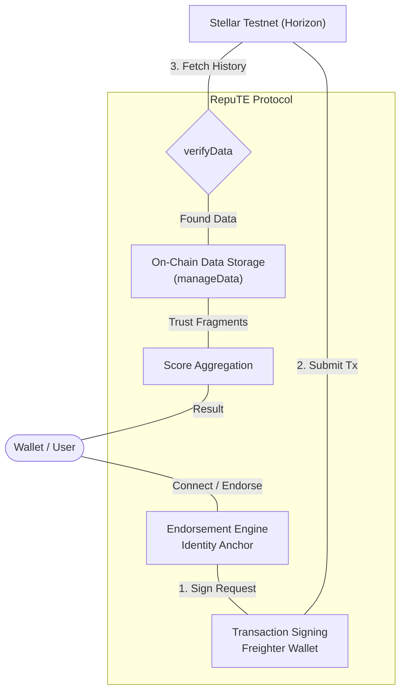
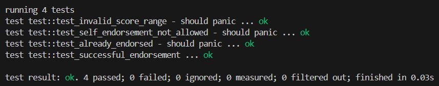
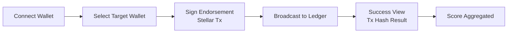

<div align="center">
  <h1>RepuTE</h1>
  <p><b>Stellar On-Chain Reputation System: Trust is earned. Reputation is proof.</b></p>

  <a href="https://d-app-reputation-system-xmjy.vercel.app"></a>
  <a href="https://drive.google.com/file/d/1hmRtNW-MiJ7Epk8dBr604tM1m6JKnlWc/view?usp=drive_link"></a>

  
  
  
  
  
  <br><br>

  

  <br><br>

  <i>RepuTE is a decentralized reputation infrastructure allowing users to issue and look up cryptographically signed endorsements on the Stellar network.</i>

  <br><br>

  <a href="#protocol">On-Chain Protocol</a> • 
  <a href="#architecture">Architecture</a> • 
  <a href="#ui-refresh">RepuTE v2.0</a> • 
  <a href="#plan">Pipeline</a> • 
  <a href="#setup">Quick Start</a>
</div>

---

<a name="ui-refresh"></a>
## 🌟 Enterprise UI Overhaul (v2.0)

RepuTE features a high-density **Sovereign Ledger Aesthetic**, built for maximum clarity and institutional trust.

### ✨ Key New Features
- 🌘 **"True Black" Design System**: Deep slate surfaces with cyan glow accents for high-end readability.
- ⭕ **Animated Score Index**: A real-time reputation ring that scales visually as trust fragments are added on-chain.
- ⚡ **Freighter-Native Integration**: One-click authentication and transaction signing directly from the landing page.
- 📊 **Momentum Analytics**: Visual bar charts tracking reputation delta and transaction density over time.
- 🔗 **Deep Explorer Linking**: Every endorsement is tied to a verifiable Stellar transaction hash with a dedicated tracking portal.

---

## 📖 What is this?

**RepuTE** is a reputation economy infrastructure built on Stellar. It solves the "trust gap" in decentralized ecosystems by allowing anyone to endorse a wallet with a specific category (e.g., *Dev Excellence*, *Liquidity Provider*) and a reputation score.

Every endorsement is **immutable**, stored as a `manageData` operation on the Stellar testnet ledger. Give it a wallet address — it automatically:

1. **Fetches the identity** anchor from the Stellar Horizon network.
2. **Aggregates endorsements** stored across the transaction history.
3. **Calculates a score index** based on the frequency and quality of peer trust fragments.
4. **Visualizes the rank** (e.g., Top 25%) within the global RepuTE network.
5. **Logs every action** on-chain ensuring a 1:1 audit trail.

---

## 🔑 Why Stellar?

> **The efficiency layer for global reputation fragments**

### The Problem
Trust systems on traditional chains suffer from:
- **Prohibitive costs** for small social endorsements.
- **Privacy issues** when storing large social graphs.
- **Complexity** in retrieving historical trust snapshots.

### Why We Chose Stellar

| Feature | Legacy Systems | RepuTE on Stellar |
|:--- |:--- |:--- |
| **Transaction Fees** | High & Volatile | ✅ **Fractional & Constant** |
| **Settlement Speed** | 10s to 15m | ✅ **5s Finality** |
| **Data Storage** | Expensive Bloat | ✅ **Optimized `manageData` Ops** |
| **Account Identity** | Monolithic | ✅ **Native G-Address Anchors** |
| **Accessibility** | Siloed | ✅ **Interoperable SDKs** |

---

<a name="architecture"></a>
## 🏗️ Architecture

### High-Level Flow



The architecture ensures data integrity:
1. **Endorser**: Selects a target address and category, then signs a transaction.
2. **Protocol**: Stores raw endorsement data into a `manageData` entry keyed to the target's address fragment.
3. **Ledger**: The transaction hash becomes the permanent proof of this social trust.
4. **Client**: The Dashboard reads the ledger state to reconstruct the reputation profile.

---

## 🛠️ Tech Stack & Tools

| Layer | Technology | Purpose |
|:---|:---|:---|
| **Frontend** | React 19 | Modern reactive UI engine |
| **Blockchain** | Stellar SDK v14 | Horizon & Soroban RPC integration |
| **Smart Contract** | Rust (Soroban SDK 22) | On-chain reputation logic with custom errors |
| **Wallet** | `@creit.tech/stellar-wallets-kit` | Multi-wallet support (Freighter, xBull, Albedo) |
| **Styling** | CSS3 Design System | Custom HSL dark-mode token system |
| **Routing** | React Router v7 | SPA page navigation |
| **Explorer** | Stellar Expert | Transaction deep-link inspection |

---

## 🧪 Test Suite

The Soroban smart contract has **4 passing unit tests** covering all 3 custom error types:

```bash
# Run all contract tests
cd contract/hello_world
cargo test
```

| Test | Scenario | Expected |
|:---|:---|:---|
| `test_successful_endorsement` | Valid endorsement | ✅ Stores endorsement & emits event |
| `test_self_endorsement_not_allowed` | Endorsing own address | ❌ Error #1 – `SelfEndorsementNotAllowed` |
| `test_invalid_score_range` | Score > 1000 | ❌ Error #2 – `InvalidScoreRange` |
| `test_already_endorsed` | Duplicate endorsement | ❌ Error #3 – `AlreadyEndorsed` |

> **Result**: `4 tests passed; 0 failed`

### 📸 Test Output Proof



---

<a name="contract"></a>
## 🔗 Deployed Contract
**Address**: `CCE4HERRLNWDJYGOD637TQCHZSMEY6TODMXL3R6GLLPZJKFDJU42TFIT`
- [View on Stellar.Expert Explorer](https://stellar.expert/explorer/testnet/contract/CCE4HERRLNWDJYGOD637TQCHZSMEY6TODMXL3R6GLLPZJKFDJU42TFIT)

### 📸 Smart Contract Dashboard


---

## ✅ Proof of Payment

> **Real transaction on Stellar Soroban Testnet**

| Field | Value |
|:---|:---|
| **Transaction Hash** | [`7024344d6915a9cfea5cf8f41120484f7a2787ab97181cfedcf90c067bf37a42`](https://stellar.expert/explorer/testnet/tx/7024344d6915a9cfea5cf8f41120484f7a2787ab97181cfedcf90c067bf37a42) |
| **Function Called** | `Reputaion statement ` |
| **Reputaion Hash** | `7024344d6915a9cfea5cf8f41120484f7a2787ab97181cfedcf90c067bf37a42` |
| **Status** | ✅ Success |
| **Network** | Stellar Soroban (Testnet) |
| **Processed** | `Sun, Mar 22, 2026, 05:56:31 UTC` |
| **Fee Charged** | `0.00001 XLM` |

🔗 [View on Stellar Expert](https://stellar.expert/explorer/testnet/tx/7024344d6915a9cfea5cf8f41120484f7a2787ab97181cfedcf90c067bf37a42))

### 📸 Transaction Proof Screenshot


---

<a name="plan"></a>
## 🏗️ Pipeline (Operation Flow)



### 1. Protocol Functions
- **`Connect`**: Auth via Freighter to establish the identity anchor.
- **`Endorse(addr, cat, score)`**: 
  - Builds a Stellar transaction with custom `manageData`.
  - Submits to Horizon for permanent storage.
- **`Lookup(addr)`**: 
  - Scans account history for `repute:` prefixed data.
  - Reconstructs the historical trust graph.

### 2. Supported Wallets
- **Freighter** (via `@creit.tech/stellar-wallets-kit`)
- **xBull Wallet** (via `@creit.tech/stellar-wallets-kit`)
- **Albedo** (via `@creit.tech/stellar-wallets-kit`)

---

## 📁 Project Structure

```text
.
├── README.md                   # Project documentation
├── Cargo.toml                  # Rust workspace configuration
├── contract/
│   └── hello_world/
│       └── src/
│           ├── lib.rs          # Reputation smart contract (3 errors, events)
│           └── test.rs         # 4 unit tests (all passing)
└── frontend/                   # React Frontend Application
    ├── public/                 # Static assets & Branding
    └── src/
        ├── context/
        │   └── WalletContext.js  # Multi-wallet state provider
        ├── components/
        │   ├── Freighter.js      # Soroban RPC + WalletsKit integration
        │   ├── Sidebar.js        # Navigation sidebar
        │   └── TopNav.js         # Top navigation bar
        ├── pages/
        │   ├── LandingPage.js    # Wallet connect entry page
        │   ├── DashboardPage.js  # Score ring + real-time events
        │   ├── EndorsePage.js    # Submit endorsement (calls contract)
        │   └── LookupPage.js     # Lookup wallet reputation
        ├── App.js               # Router & Layout
        └── App.css              # Design System Styles
```

---

<a name="setup"></a>
## ⚙️ Environment Setup & Installation

### A) Prerequisites
- **Node.js**: v18+
- **Rust + Cargo**: [Install via rustup](https://rustup.rs/)
- A Stellar wallet extension (Freighter, xBull, or Albedo)

### B) Frontend Setup
1. **Clone the repo**:
   ```bash
   git clone https://github.com/jayjit-2025/dApp-Reputation-System.git
   cd dApp-Reputation-System/frontend
   ```
2. **Install dependencies**:
   ```bash
   npm install
   ```
3. **Run development server**:
   ```bash
   npm start
   ```
4. **Access the portal**: Open [https://localhost:3000](https://localhost:3000)

### C) Smart Contract (optional — already deployed)
```bash
cd contract/hello_world
cargo test        # Run the 4 unit tests
cargo build --target wasm32-unknown-unknown --release  # Build WASM
```

---

## 🎬 Demo Video

[](https://drive.google.com/file/d/1hmRtNW-MiJ7Epk8dBr604tM1m6JKnlWc/view?usp=drive_link)

---

## 👨‍💻 Author
**Jayjit Dutta**
- Building on Stellar — Trust is earned. Reputation is proof.
- [GitHub](https://github.com/jayjit-2025) · [Live App](https://d-app-reputation-system-xmjy.vercel.app) · [Demo Video](https://drive.google.com/file/d/1hmRtNW-MiJ7Epk8dBr604tM1m6JKnlWc/view?usp=drive_link)
