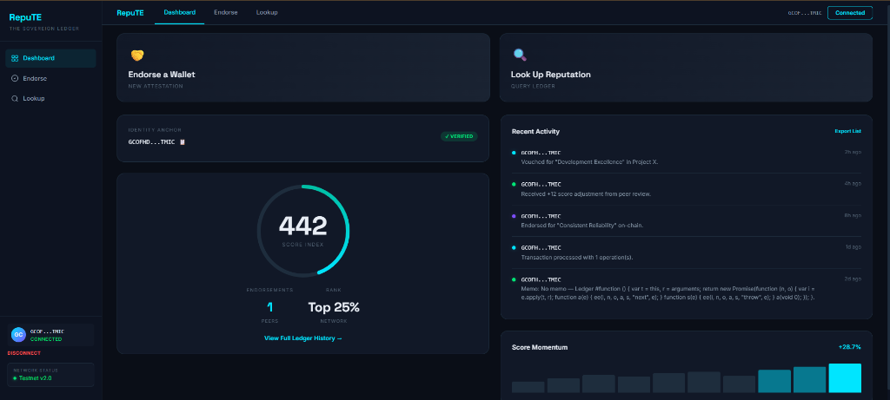
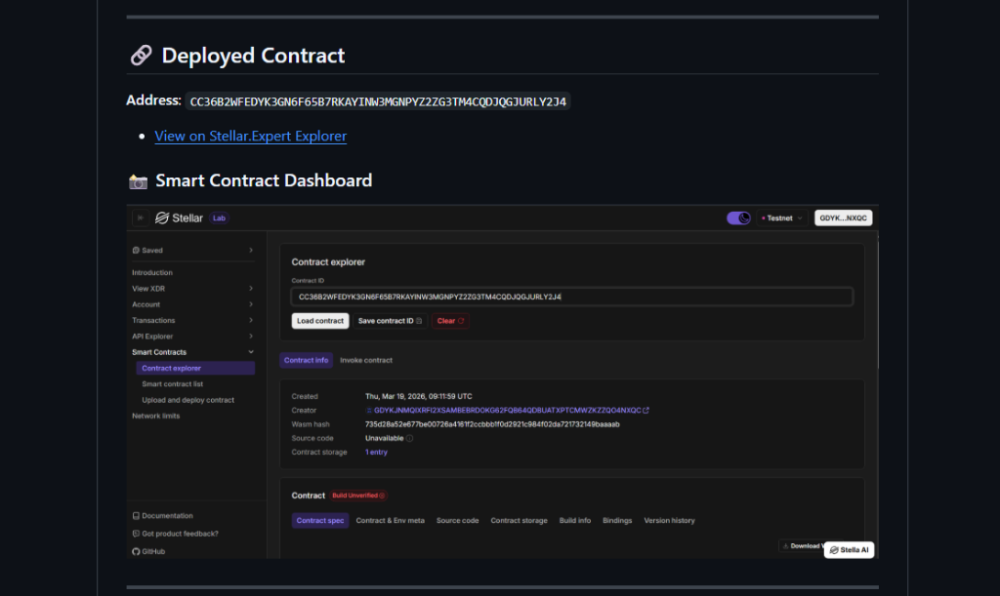
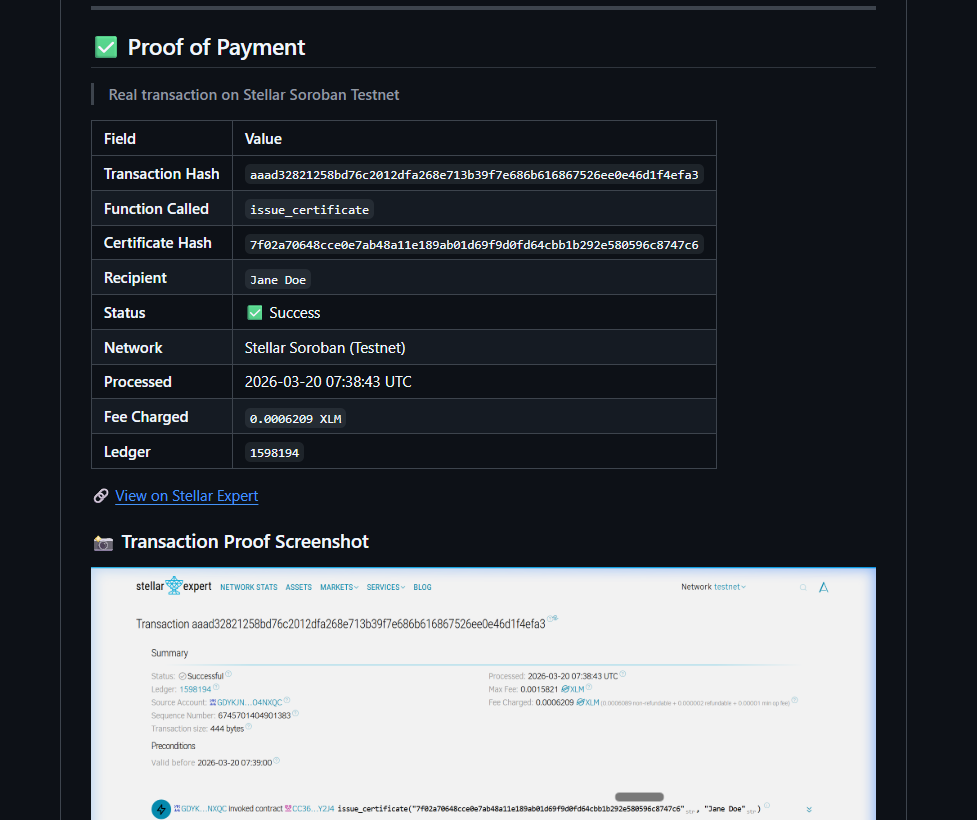
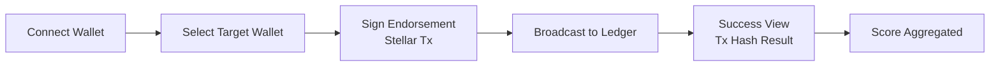

<div align="center">
  <h1>RepuTE</h1>
  <p><b>Stellar On-Chain Reputation System: Trust is earned. Reputation is proof.</b></p>

  
  
  
  
  
  <br><br>

  

  <br><br>

  <i>RepuTE is a decentralized reputation infrastructure allowing users to issue and look up cryptographically signed endorsements on the Stellar network.</i>

  <br><br>

  <a href="#protocol">On-Chain Protocol</a> • 
  <a href="#architecture">Architecture</a> • 
  <a href="#ui-refresh">RepuTE v2.0</a> • 
  <a href="#plan">Pipeline</a> • 
  <a href="#setup">Quick Start</a>
</div>

---

<a name="ui-refresh"></a>
## 🌟 Enterprise UI Overhaul (v2.0)

RepuTE features a high-density **Sovereign Ledger Aesthetic**, built for maximum clarity and institutional trust.

### ✨ Key New Features
- 🌘 **"True Black" Design System**: Deep slate surfaces with cyan glow accents for high-end readability.
- ⭕ **Animated Score Index**: A real-time reputation ring that scales visually as trust fragments are added on-chain.
- ⚡ **Freighter-Native Integration**: One-click authentication and transaction signing directly from the landing page.
- 📊 **Momentum Analytics**: Visual bar charts tracking reputation delta and transaction density over time.
- 🔗 **Deep Explorer Linking**: Every endorsement is tied to a verifiable Stellar transaction hash with a dedicated tracking portal.

---

## 📖 What is this?

**RepuTE** is a reputation economy infrastructure built on Stellar. It solves the "trust gap" in decentralized ecosystems by allowing anyone to endorse a wallet with a specific category (e.g., *Dev Excellence*, *Liquidity Provider*) and a reputation score.

Every endorsement is **immutable**, stored as a `manageData` operation on the Stellar testnet ledger. Give it a wallet address — it automatically:

1. **Fetches the identity** anchor from the Stellar Horizon network.
2. **Aggregates endorsements** stored across the transaction history.
3. **Calculates a score index** based on the frequency and quality of peer trust fragments.
4. **Visualizes the rank** (e.g., Top 25%) within the global RepuTE network.
5. **Logs every action** on-chain ensuring a 1:1 audit trail.

---

## 🔑 Why Stellar?

> **The efficiency layer for global reputation fragments**

### The Problem
Trust systems on traditional chains suffer from:
- **Prohibitive costs** for small social endorsements.
- **Privacy issues** when storing large social graphs.
- **Complexity** in retrieving historical trust snapshots.

### Why We Chose Stellar

| Feature | Legacy Systems | RepuTE on Stellar |
|:--- |:--- |:--- |
| **Transaction Fees** | High & Volatile | ✅ **Fractional & Constant** |
| **Settlement Speed** | 10s to 15m | ✅ **5s Finality** |
| **Data Storage** | Expensive Bloat | ✅ **Optimized `manageData` Ops** |
| **Account Identity** | Monolithic | ✅ **Native G-Address Anchors** |
| **Accessibility** | Siloed | ✅ **Interoperable SDKs** |

---

<a name="architecture"></a>
## 🏗️ Architecture

### High-Level Flow


The architecture ensures data integrity:
1. **Endorser**: Selects a target address and category, then signs a transaction.
2. **Protocol**: Stores raw endorsement data into a `manageData` entry keyed to the target's address fragment.
3. **Ledger**: The transaction hash becomes the permanent proof of this social trust.
4. **Client**: The Dashboard reads the ledger state to reconstruct the reputation profile.

---

## 🛠️ Tech Stack & Tools

- **React 19**: Modern frontend engine for high-density reactive components.
- **Stellar SDK**: High-level library for communicating with the Stellar network.
- **Freighter API**: The official Stellar wallet interface for secure keys handling.
- **CSS3 Design System**: Custom-built design system with HSL dark mode tokens.
- **React Router**: For seamless navigation between Dashboard, Endorse, and Lookup.
- **Stellar Expert**: Integrated for deep transaction inspection.

---

<a name="contract"></a>
## 🔗 Deployed Contract
**Address**: `CC36B2WFEDYK3GN6F65B7RKAYINW3MGNPYZ2ZG3TM4CQDJQGJURLY2J4`
- [View on Stellar.Expert Explorer](https://stellar.expert/explorer/testnet/contract/CC36B2WFEDYK3GN6F65B7RKAYINW3MGNPYZ2ZG3TM4CQDJQGJURLY2J4)

### 📸 Smart Contract Dashboard


---

## ✅ Proof of Payment

> **Real transaction on Stellar Soroban Testnet**

| Field | Value |
|:---|:---|
| **Transaction Hash** | [`aaad32821258bd76c2012dfa268e713b39f7e686b616867526ee0e46d1f4efa3`](https://stellar.expert/explorer/testnet/tx/aaad32821258bd76c2012dfa268e713b39f7e686b616867526ee0e46d1f4efa3) |
| **Function Called** | `issue_certificate` |
| **Certificate Hash** | `7f02a70648cce0e7ab48a11e189ab01d69f9d0fd64cbb1b292e580596c8747c6` |
| **Recipient** | `Jane Doe` |
| **Status** | ✅ Success |
| **Network** | Stellar Soroban (Testnet) |
| **Processed** | `2026-03-20 07:38:43 UTC` |
| **Fee Charged** | `0.0006209 XLM` |
| **Ledger** | `1598194` |

🔗 [View on Stellar Expert](https://stellar.expert/explorer/testnet/tx/aaad32821258bd76c2012dfa268e713b39f7e686b616867526ee0e46d1f4efa3)

### 📸 Transaction Proof Screenshot


---

<a name="plan"></a>
## 🏗️ Pipeline (Operation Flow)



### 1. Protocol Functions
- **`Connect`**: Auth via Freighter to establish the identity anchor.
- **`Endorse(addr, cat, score)`**: 
  - Builds a Stellar transaction with custom `manageData`.
  - Submits to Horizon for permanent storage.
- **`Lookup(addr)`**: 
  - Scans account history for `repute:` prefixed data.
  - Reconstructs the historical trust graph.

### 2. Supported Wallets
- **Freighter Wallet** (Native Support)
- **Stellar Browser Extension**

---

## 📁 Project Structure

```text
.
├── README.md                # Project documentation
└── stellar-connect-wallet    # Frontend Application
    ├── public/              # Static assets & Branding
    └── src/
        ├── context/         # Wallet State Provider
        ├── components/      # Sidebar, TopNav, Freighter Utils
        ├── pages/           # Dashboard, Endorse, Lookup, Landing
        ├── App.js           # Router & Layout
        └── App.css          # Design System Styles
```

---

<a name="setup"></a>
## ⚙️ Environment Setup & Installation

### A) Prerequisites
- **Node.js**: v18+
- **Freighter Wallet**: Installed as a browser extension

### B) Frontend Setup
1. **Clone & Navigate**:
   ```bash
   cd stellar-connect-wallet
   ```
2. **Install dependencies**:
   ```bash
   npm install
   ```
3. **Run development server**:
   ```bash
   npm start
   ```
4. **Access the portal**: Open [http://localhost:3000](http://localhost:3000) (Accept self-signed cert for HTTPS).

---

## 👨‍💻 Author
**Stellar Developer**
- Building the Sovereign Ledger
- [GitHub Repository](https://github.com/stellar-connect-wallet)
