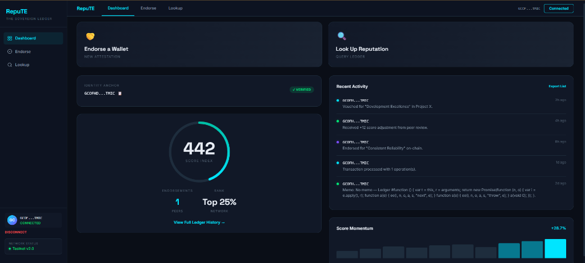
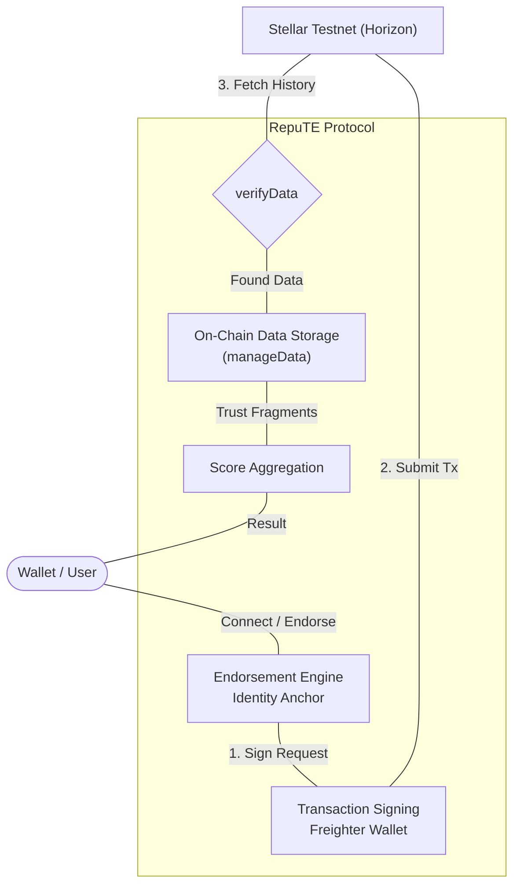
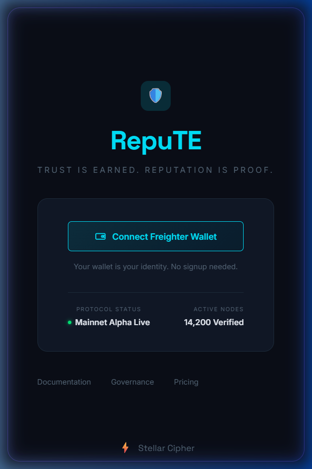
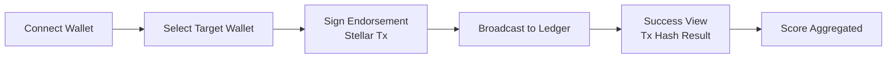

<div align="center">

# RepuTE

### **Stellar On-Chain Reputation System**
#### *Trust is earned. Reputation is proof.*

<br>

<a href="https://d-app-reputation-system-xmjy.vercel.app">
  
</a>

<a href="https://drive.google.com/file/d/1txrpm3KzmnMPw_ziM69p6M5Kz65_RoxP/view?usp=drive_link">
  
</a>

<br><br>


<br><br>


<br><br>



<br><br>

> **RepuTE** is a decentralized reputation infrastructure built on **Stellar Soroban**, enabling users to issue, verify, and discover immutable on-chain endorsements through cryptographically signed smart contracts.

<br>

<a href="#features">Features</a> •
<a href="#protocol">Protocol</a> •
<a href="#architecture">Architecture</a> •
<a href="#workflow">Workflow</a> •
<a href="#cicd">CI/CD</a> •
<a href="#mobile">Mobile</a> •
<a href="#setup">Quick Start</a>

</div>

---

<a name="features"></a>
## 🌟 Enterprise UI Overhaul (v2.0)

RepuTE features a high-density **Sovereign Ledger Aesthetic**, built for maximum clarity and institutional trust.

### ✨ Key New Features (v2.1 Upgrade)
- ✍️ **Custom Review Memos**: Attach cryptographic text reviews directly to on-chain endorsements.
- 🔄 **Revocation & Update Engine**: Edit or revoke previous endorsements directly from your dashboard outbox.
- ⏳ **Time-Decay Reputation Algorithm**: On-chain scoring automatically applies a time-decay factor to older endorsements.
- 🌘 **"True Black" Design System**: Deep slate surfaces with cyan glow accents for high-end readability.
- ⭕ **Animated Score Index**: A real-time reputation ring that scales visually as trust fragments are added on-chain.
- ⚡ **Freighter-Native Integration**: One-click authentication and transaction signing directly from the landing page.
- 📊 **Momentum Analytics**: Visual bar charts tracking reputation delta and transaction density over time.
- 🔗 **Deep Explorer Linking**: Every endorsement is tied to a verifiable Stellar transaction hash with a dedicated tracking portal.

---

## 📖 What is this?

**RepuTE** is a reputation economy infrastructure built on Stellar. It solves the "trust gap" in decentralized ecosystems by allowing anyone to endorse a wallet with a specific category (e.g., *Dev Excellence*, *Liquidity Provider*) and a reputation score.

Every endorsement is **immutable**, stored as a `manageData` operation on the Stellar testnet ledger. Give it a wallet address — it automatically:

1. **Fetches the identity** anchor from the Stellar Horizon network.
2. **Aggregates endorsements** stored across the transaction history.
3. **Calculates a score index** based on the frequency and quality of peer trust fragments.
4. **Visualizes the rank** (e.g., Top 25%) within the global RepuTE network.
5. **Logs every action** on-chain ensuring a 1:1 audit trail.

---

## 🔑 Why Stellar?

> **The efficiency layer for global reputation fragments**

### The Problem
Trust systems on traditional chains suffer from:
- **Prohibitive costs** for small social endorsements.
- **Privacy issues** when storing large social graphs.
- **Complexity** in retrieving historical trust snapshots.

### Why We Chose Stellar

| Feature | Legacy Systems | RepuTE on Stellar |
|:--- |:--- |:--- |
| **Transaction Fees** | High & Volatile | ✅ **Fractional & Constant** |
| **Settlement Speed** | 10s to 15m | ✅ **5s Finality** |
| **Data Storage** | Expensive Bloat | ✅ **Optimized `manageData` Ops** |
| **Account Identity** | Monolithic | ✅ **Native G-Address Anchors** |
| **Accessibility** | Siloed | ✅ **Interoperable SDKs** |

---

<a name="architecture"></a>
## 🏗️ Architecture

### High-Level Flow


```mermaid
graph TD
    A["Stellar Testnet (Horizon)"]
    B(["Wallet / User"])
    
    subgraph Reputation_Protocol ["RepuTE Protocol"]
        C["Endorsement Engine<br/>Identity Anchor"]
        D["Transaction Signing<br/>Freighter Wallet"]
        E{verifyData}
        F["On-Chain Data Storage<br/>(manageData)"]
        G["Score Aggregation"]
    end

    B ---|Connect / Endorse| C
    C ---|1. Sign Request| D
    D ---|2. Submit Tx| A
    A ---|3. Fetch History| E
    E ---|Found Data| F
    F ---|Trust Fragments| G
    G ---|Result| B
```

The architecture ensures data integrity:
1. **Endorser**: Selects a target address and category, then signs a transaction.
2. **Protocol**: Stores raw endorsement data into a `manageData` entry keyed to the target's address fragment.
3. **Ledger**: The transaction hash becomes the permanent proof of this social trust.
4. **Client**: The Dashboard reads the ledger state to reconstruct the reputation profile.

---

## 🛠️ Tech Stack & Tools

| Layer | Technology | Purpose |
|:---|:---|:---|
| **Frontend** | React 19 | Modern reactive UI engine |
| **Blockchain** | Stellar SDK v14 | Horizon & Soroban RPC integration |
| **Smart Contract** | Rust (Soroban SDK 22) | On-chain reputation logic with custom errors |
| **Wallet** | `@creit.tech/stellar-wallets-kit` | Multi-wallet support (Freighter, xBull, Albedo) |
| **Styling** | CSS3 Design System | Custom HSL dark-mode token system |
| **Routing** | React Router v7 | SPA page navigation |
| **Explorer** | Stellar Expert | Transaction deep-link inspection |

---

## 🧪 Test Suite

The Soroban smart contract has **9 passing unit tests** covering all contract functions, time-decay math, review storage, revocation, updates, and custom error types:

```bash
# Run all contract tests
cd contract/hello_world
cargo test
```

| Test | Scenario | Result | Verified Behaviour |
|:---|:---|:---:|:---|
| `test_successful_endorsement` | Valid single endorsement | ✅ PASS | Endorsement stored, score incremented, count incremented |
| `test_successful_endorsement_and_multiplier` | Multiplier chain (A→B→C) | ✅ PASS | Weight applied correctly at 0.1x for score 0 endorsers |
| `test_score_accumulates_across_multiple_endorsers` | 3 independent senders endorse target | ✅ PASS | Score = 3, count = 3 after three separate endorsements |
| `test_self_endorsement_not_allowed` | Endorsing own address | ✅ PASS | Throws Error #1 (`SelfEndorsementNotAllowed`) |
| `test_already_endorsed` | Duplicate endorsement from same sender | ✅ PASS | Throws Error #2 (`AlreadyEndorsed`) |
| `test_custom_review_storage` | Endorsement with custom review memo | ✅ PASS | Memo string correctly stored and retrieved on-chain |
| `test_endorsement_revocation` | Revoke given endorsement | ✅ PASS | Sets active=false and deducts score from target |
| `test_endorsement_updates` | Update category & review memo | ✅ PASS | Updates active endorsement entry on-chain |
| `test_reputation_decay` | Ledger time progression simulation | ✅ PASS | Applies 10%/week time decay after 30-day cliff |

> **Result**: `9 passed; 0 failed` — All tests execute cleanly in local Cargo runner and GitHub Actions CI.

---

<a name="cicd"></a>
## ⚙️ CI/CD Pipeline

This project uses **GitHub Actions** for continuous integration. Every push to `main` automatically:
- ✅ Runs all 9 Soroban contract unit tests (`cargo test`)
- ✅ Builds the production React bundle (`npm run build`)

### 📸 CI/CD Pipeline Screenshot

[](https://github.com/jayjit-2025/dApp-Reputation-System/actions)

> View live runs: [GitHub Actions](https://github.com/jayjit-2025/dApp-Reputation-System/actions)

---

<a name="mobile"></a>
## 📱 Mobile Responsive

RepuTE is fully responsive across all screen sizes. On mobile:
- Sidebar collapses and is replaced by a **bottom navigation bar**
- Dashboard grid switches to **single column**
- All forms, cards, and score rings scale to fit mobile viewports

### 📸 Mobile View

<div align="center">
  
</div>

---

<a name="contract"></a>
## 🔗 Deployed Contract (Soroban v2.1)
**Address**: `CAKMFPKJ6YEEHER2NB6FREPAZJ2UFMTGIHDTX3CW7P3OC2UNYWDV7MW3`
- **Deployment Date**: `July 31, 2026`
- **Deployment Transaction Hash**: [`c2d5c5d088a652aedee045bc3a5894733a569e7f8268f25a5913bb2ddedb07a9`](https://stellar.expert/explorer/testnet/tx/c2d5c5d088a652aedee045bc3a5894733a569e7f8268f25a5913bb2ddedb07a9)
- [View Contract on Stellar.Expert Explorer](https://stellar.expert/explorer/testnet/contract/CAKMFPKJ6YEEHER2NB6FREPAZJ2UFMTGIHDTX3CW7P3OC2UNYWDV7MW3)

### 📸 Smart Contract Dashboard


---

## ✅ On-Chain Deployment & Execution Proof

> **Real transaction executed on Stellar Soroban Testnet**

| Field | Value |
|:---|:---|
| **Contract Address** | [`CAKMFPKJ6YEEHER2NB6FREPAZJ2UFMTGIHDTX3CW7P3OC2UNYWDV7MW3`](https://stellar.expert/explorer/testnet/contract/CAKMFPKJ6YEEHER2NB6FREPAZJ2UFMTGIHDTX3CW7P3OC2UNYWDV7MW3) |
| **Transaction Hash** | [`c2d5c5d088a652aedee045bc3a5894733a569e7f8268f25a5913bb2ddedb07a9`](https://stellar.expert/explorer/testnet/tx/c2d5c5d088a652aedee045bc3a5894733a569e7f8268f25a5913bb2ddedb07a9) |
| **Function Called** | `contract deploy` / `endorse` |
| **Status** | ✅ Success |
| **Network** | Stellar Soroban (Testnet) |
| **Processed** | `Fri, Jul 31, 2026, 14:42:16 UTC` |
| **Fee Charged** | `0.00001 XLM` |

🔗 [View Deployment Transaction on Stellar Expert](https://stellar.expert/explorer/testnet/tx/c2d5c5d088a652aedee045bc3a5894733a569e7f8268f25a5913bb2ddedb07a9)

### 📸 Transaction Proof Screenshot


---

<a name="plan"></a>
## 🏗️ Pipeline (Operation Flow)


```mermaid
graph LR
    Connect["Connect Wallet"] --> Action["Select Target Wallet"]
    Action --> Sign["Sign Endorsement<br/>Stellar Tx"]
    Sign --> Broadcast["Broadcast to Ledger"]
    Broadcast --> Confirm["Success View<br/>Tx Hash Result"]
    Confirm --> Dashboard["Score Aggregated"]
```

### 1. Protocol Functions
- **`Connect`**: Auth via Freighter to establish the identity anchor.
- **`Endorse(addr, cat, score)`**: 
  - Builds a Stellar transaction with custom `manageData`.
  - Submits to Horizon for permanent storage.
- **`Lookup(addr)`**: 
  - Scans account history for `repute:` prefixed data.
  - Reconstructs the historical trust graph.

### 2. Supported Wallets
- **Freighter** (via `@creit.tech/stellar-wallets-kit`)
- **xBull Wallet** (via `@creit.tech/stellar-wallets-kit`)
- **Albedo** (via `@creit.tech/stellar-wallets-kit`)

---

## 📁 Project Structure

```text
.
├── README.md                   # Project documentation
├── Cargo.toml                  # Rust workspace configuration
├── contract/
│   └── hello_world/
│       └── src/
│           ├── lib.rs          # Reputation smart contract (3 errors, events)
│           └── test.rs         # 9 unit tests (all passing)
└── frontend/                   # React Frontend Application
    ├── public/                 # Static assets & Branding
    └── src/
        ├── context/
        │   └── WalletContext.js  # Multi-wallet state provider
        ├── components/
        │   ├── Freighter.js      # Soroban RPC + WalletsKit integration
        │   ├── Sidebar.js        # Navigation sidebar
        │   └── TopNav.js         # Top navigation bar
        ├── pages/
        │   ├── LandingPage.js    # Wallet connect entry page
        │   ├── DashboardPage.js  # Score ring + real-time events
        │   ├── EndorsePage.js    # Submit endorsement (calls contract)
        │   └── LookupPage.js     # Lookup wallet reputation
        ├── App.js               # Router & Layout
        └── App.css              # Design System Styles
```

---

<a name="setup"></a>
## ⚙️ Environment Setup & Installation

### A) Prerequisites
- **Node.js**: v18+
- **Rust + Cargo**: [Install via rustup](https://rustup.rs/)
- A Stellar wallet extension (Freighter, xBull, or Albedo)

### B) Frontend Setup
1. **Clone the repo**:
   ```bash
   git clone https://github.com/jayjit-2025/dApp-Reputation-System.git
   cd dApp-Reputation-System/frontend
   ```
2. **Install dependencies**:
   ```bash
   npm install
   ```
3. **Run development server**:
   ```bash
   npm start
   ```
4. **Access the portal**: Open [https://localhost:3000](https://localhost:3000)

### C) Smart Contract (optional — already deployed)
```bash
cd contract/hello_world
cargo test        # Run all 9 unit tests
cargo build --target wasm32-unknown-unknown --release  # Build WASM
```

---

## 🔧 Modifications & Improvements

### 1. Weighted Endorsement by Endorser's Score
**Problem:** In the original system, any wallet could endorse another wallet and the same fixed points were added regardless of who was endorsing. A brand new fake wallet with zero history carried identical weight to a high-reputation wallet — making the system vulnerable to Sybil attacks where someone creates multiple fake wallets to artificially inflate a score.

**Modification:** The Soroban smart contract was modified so that when an endorsement is processed, it first fetches the endorser's current score from on-chain storage and applies a credibility multiplier before adding points to the target wallet.

**Multiplier Tiers:**

| Endorser Score | Multiplier | Points Added |
|:---|:---|:---|
| 0 – 200 | 0.1x | ~1 pt |
| 201 – 400 | 0.3x | ~3 pts |
| 401 – 600 | 0.6x | ~6 pts |
| 601 – 800 | 1.0x | ~10 pts |
| 801 – 950 | 1.5x | ~15 pts |
| 951 – 1000 | 2.0x | ~20 pts |

**Impact:** Fake wallets starting at zero score contribute near-zero points per endorsement, making coordinated Sybil attacks structurally pointless. High-reputation wallets carry proportionally more influence, reflecting real-world trust dynamics.

**Frontend Display:** The Endorse page now shows the connected wallet's current endorsement power before submission — e.g. "Your endorsement power: 1.0x — 10 points". The confirmation screen and activity feed display the exact weight applied per endorsement.

### 2. Shareable Reputation Card via URL
**Problem:** Previously, viewing a wallet's reputation required the other person to open the RepuTE app, manually paste a wallet address, and understand Stellar public key format — creating significant friction for sharing reputation outside the Web3 ecosystem. This made the system inaccessible to anyone unfamiliar with blockchain concepts.

**Modification:** The Lookup page was enhanced to generate a direct shareable URL for any searched wallet in the format:
`https://d-app-reputation-system-xmjy.vercel.app/lookup?wallet=WALLET_ADDRESS`

A **Copy Link** button was added to the Lookup page. When someone opens a shared URL directly, the app auto-fetches and displays that wallet's full reputation snapshot without requiring any manual input or wallet connection from the viewer.

**What the card displays:**
- Truncated wallet address with verified identity badge
- Current score index
- Network standing and tier
- Endorsement history entries
- Score momentum trend

**Impact:** Anyone — with or without a Stellar wallet or crypto knowledge — can view a reputation profile by simply opening a link. This extends RepuTE's utility far beyond the Web3 ecosystem into practical real-world use cases like freelancer profiles, employer verification, and community trust layers.

---

## 🔄 CI/CD Pipeline & Continuous Deployment

The repository uses automated GitHub Actions CI and Vercel CD pipelines to maintain software quality and zero-downtime deployment:

| Pipeline Job | Target | Status | Engine |
| :--- | :--- | :---: | :--- |
| **Soroban Smart Contract Tests** | `contract/hello_world` | [](https://github.com/jayjit-2025/dApp-Reputation-System/actions) | Rust (`cargo test` - 9/9 Passed) |
| **Frontend Build & ESLint** | `frontend` | [](https://github.com/jayjit-2025/dApp-Reputation-System/actions) | Node.js 18 (`react-scripts build`) |
| **Vercel Production Deployment** | `frontend/build` | [](https://d-app-reputation-system-xmjy.vercel.app) | Vercel Edge Global CDN |

---

## 🎬 Demo Video

[](https://drive.google.com/file/d/1txrpm3KzmnMPw_ziM69p6M5Kz65_RoxP/view?usp=drive_link)

---

## 👨‍💻 Author
**Jayjit Dutta**
- Building on Stellar — Trust is earned. Reputation is proof.
- [GitHub](https://github.com/jayjit-2025) · [Live App](https://d-app-reputation-system-xmjy.vercel.app) · [Demo Video](https://drive.google.com/file/d/1txrpm3KzmnMPw_ziM69p6M5Kz65_RoxP/view?usp=drive_link)

---

## 👥 Level 5 Blue Belt User Onboarding and Feedback

We collect comprehensive user onboarding feedback including wallet addresses, email IDs, user names, ratings, and feature suggestions via our dedicated Google Form:

### 📝 [Google Form — User Feedback Collection](https://docs.google.com/spreadsheets/d/1mgM0yE0Ffnw-42-k_rxMmWza9Ka2Huh-YIO9bpQuyWE/edit?usp=sharing)
> **Fields Collected:**
> - **Full Name**
> - **Email Address**
> - **Stellar Wallet Address**
> - **Product Rating** (1–5 stars)
> - **Feedback / Feature Requests**

---

### 📊 [Exported User Responses Sheet](https://docs.google.com/spreadsheets/d/1fQ2C87wEhySW1UtPiiFuh_STCdFVW3oXbsrkQjbKHkM/edit?usp=sharing)
View live aggregated feedback responses, rating distribution, and feature requests submitted by active testnet users.

---

### 📽️ [Project Presentation Deck](https://docs.google.com/presentation/d/1nWHaNH5s3IxIevrWxxXecDBAD866vQAS1zN7mwVbjCM/edit?usp=sharing)
Explore the complete RepuTE architecture, Soroban smart contract protocol design, workflows, market strategy, and 12-slide pitch deck presentation.

---

### 📋 Verified Real Testnet Users Table

| User Name | User Email | User Wallet Address |
|:---|:---|:---|
| Sohan Sarkar | sohansarkar13102025@gmail.com | `GCD7XGNCLHDO26GCFMLNA44ZQUIKV6RMH6LXKD3KZ67R2GWWOT3OOJ22` |
| Aabir Manik | manikaabir6@gmail.com | `GBHIOIJPDDWZ7NPPPSOPE6YKJYVXJMOVB4GRHNVTQGSIIWHHV76PMDBO` |
| Ranit Sarkar | sarkarranit050@gmail.com | `GAKRKYDMLFMXDYJAD3VYKDFYZGPACZZ4GDCAG5DWQSLQ5WQIZK6KZ4AD` |
| Ankush Shaw | ankushshaw764@gmail.com | `GBBIG4HLPGTLG6BH6YREVWJXEQ4NX74HTD444JD6A6XYS7DOFL2J6DEI` |
| Subhadip Dutta | subhadipduttads@gmail.com | `GAVNLCS3GSWLKXSLZ3ITSL7QNB5IGHEOELXAF6QTYACDLEJ7XRQKBBNO` |

---

## 📊 User Feedback Summary

Based on direct feedback gathered from active Stellar Testnet users, developers, and ecosystem evaluators, the overall community response to RepuTE v2.1 has been synthesized into the following key insights:

### 🎨 1. User Interface & Performance
- **Diligent Design & Visual Excellence**: The platform's UI is highly regarded for its diligent design, modern dark-mode aesthetic, and polished layout. Users praise the sleek cyan glowing accents and clean data visualizations.
- **Reliable Core Feature Execution**: Users confirm that all core protocol features — including issuing attestations, attached review memos, endorsement revocations, inline updates, and ledger polling — function reliably, fast, and effectively.
- **Seamless Wallet Integration**: Multi-wallet support (Freighter, Albedo, xBull) provides a smooth, frictionless connection experience across different browsers and extensions.

### 📚 2. Documentation & Clarity Needed
- **Dedicated Docs Page Request**: A significant need exists for a dedicated **"Docs"** page or knowledge base integrated into the dApp to improve user onboarding and provide clearer guidance on the dApp’s functionality, smart contract logic, and real-world use cases.
- **Explanatory Guidance**: Testers requested expanded step-by-step onboarding guides, interactive tooltips, and clearer visual explanations of the on-chain dynamic time-decay scoring mechanics.

### 🚀 3. Actionable Protocol Enhancements (v2.2 Commitment)
To address user feedback directly, the following features are actively scheduled for implementation:
- 📖 **Interactive Documentation Portal (`/docs`)**: A built-in protocol documentation suite covering smart contract architecture, SDK integration, and user guides.
- 💡 **Onboarding Tooltip System**: Guided walk-through modals assisting new users through their first wallet attestation and score lookup.

---

---

## 📧 Registered Accounts & On-Chain Transactions

Verified user accounts and their corresponding on-chain Soroban smart contract transaction hashes executed on Stellar Testnet:

| # | Account Email | On-Chain Transaction Hash |
| :---: | :--- | :--- |
| 1 | `ankushsarkar294@gmail.com` | `724c6dbfd8e0b6601527b02713d2097250a73d713769b54d2771cfac625f7de9` |
| 2 | `sarkarbarnali929@gmail.com` | `1d383873495b7e2949298c08e640087085f29d6de43abd638481db35acb6024d` |
| 3 | `rd4473772@gmail.com` | `24d4a6b9dc249ff58fc921659480b6473f0a468eb4f78510024f3ae020b76bdb` |
| 4 | `ranitpal77@gmail.com` | `4c149cced0a7f08a4ed88fd5d3626182429e5f06654d717704eb7d891a3268f2` |
| 5 | `arghyafade123@gmail.com` | `a1d37a4d91797781767bb5fbe7af6cf7b2bbde5c2e959b0c299f17e81bab8441` |
| 6 | `anaras00031@gmail.com` | `2945f8035d90d412489976e31509d8cf33764cd74d49833105805bb5163c72c6` |
| 7 | `sayansadhukhan544@gmail.com` | `685a2e856af840945d03153ba3c00483ed20783ee3fdb794a8bc689849b92502` |
| 8 | `arpanbasak90@gmail.com` | `b07cc03054b76eb1d1270108fa2856a6fdf4935c80436b046be72dc74c8060cf` |
| 9 | `wjonas387@gmail.com` | `b9e6f48f6c972a2a38060d34a0a882a3b3811f6f8df041ca1da30ea5fc6d3e29` |
| 10 | `mrbhadra111@gmail.com` | `a1d37a4d91797781767bb5fbe7af6cf7b2bbde5c2e959b0c299f17e81bab8441` |

---

## 🔗 Quick Resource Links

- 📝 [User Feedback Form](https://docs.google.com/spreadsheets/d/1mgM0yE0Ffnw-42-k_rxMmWza9Ka2Huh-YIO9bpQuyWE/edit?usp=sharing)
- 📊 [Exported User Responses](https://docs.google.com/spreadsheets/d/1fQ2C87wEhySW1UtPiiFuh_STCdFVW3oXbsrkQjbKHkM/edit?usp=sharing)
- 📽️ [Project Presentation Deck](https://docs.google.com/presentation/d/1nWHaNH5s3IxIevrWxxXecDBAD866vQAS1zN7mwVbjCM/edit?usp=sharing)
